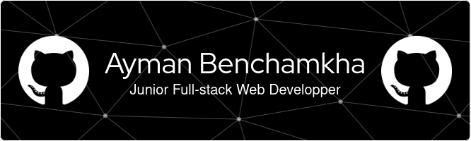

## Hi there 👋

🚀 Junior MERN Full-Stack Developer & Data Analyst 📊 passionate about leveraging data to create innovative and seamless software services. My skills encompass both software development and data analytics, enabling me to deliver intelligent, data-driven solutions that enhance user experience and drive business success.

**I love working with**

 

### 🔭 I’m working on

- Projects for freelance clients.

### Most of my work includes:

- Integrating AI models to web applications

### 📫 How to reach me

  
  

### ⚡ Fun fact

I love grotesque rpg Games;
